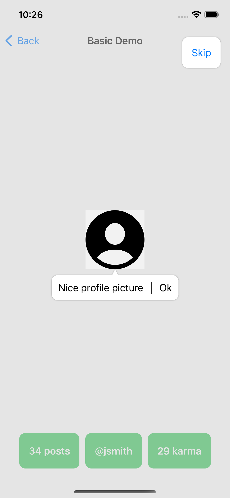

# Instructions

Guide users through your SwiftUI app with coach marks.



## Pre-release note

`Instructions` has not hit `1.0.0` yet and is undergoing active development which means APIs are unstable and may change.

## Installation

In `Package.swift`:

```swift
dependencies: [
    .package(url: "https://github.com/petomuro/Instructions", .upToNextMajor(from: "0.0.1"))
]
```

## Basic Usage

```swift
@main
struct ExampleApp: App {
    var body: some Scene {
        WindowGroup {
            InstructionsContentView {
                ContentView()
            }
        }
    }
}

struct ContentView: View {
    enum Tags: InstructionsTags {
        case hello
        
        func makeCallout() -> Callout {
            .text("This is a message saying hello")
        }
    }
    
    var body: some View {
        VStack {
            Text("Hello world")
                .instructionsTag(Tags.hello)
        }
        .instructions(isActive: true, tags: Tags.self)
    }
}
```

## .sheet and .fullscreenCover Usage

```swift
class PassThroughWindow: UIWindow {
    override func hitTest(_ point: CGPoint, with event: UIEvent?) -> UIView? {
        guard let hitView = super.hitTest(point, with: event) else {
            return nil
        }
        
        return rootViewController?.view == hitView ? nil : hitView
    }
}

struct SceneView<Content: View>: View {
    @ViewBuilder var content: Content
    
    var body: some View {
        content
            .ignoresSafeArea(.all)
    }
}

class SceneDelegate: UIResponder, UIWindowSceneDelegate, ObservableObject {
    var scSceneWindow: UIWindow?
    weak var windowScene: UIWindowScene?
    
    func scene(_ scene: UIScene, willConnectTo session: UISceneSession, options connectionOptions: UIScene.ConnectionOptions) {
        windowScene = scene as? UIWindowScene
    }
    
    func setupWindow<V: View>(@ViewBuilder content: () -> V) {
        guard let windowScene = windowScene else {
            return
        }
        
        let scSceneViewController = UIHostingController(rootView: SceneView {
            content()
        })
        scSceneViewController.view.backgroundColor = .clear
        
        let scSceneWindow = PassThroughWindow(windowScene: windowScene)
        scSceneWindow.rootViewController = scSceneViewController
        scSceneWindow.isHidden = false
        
        self.scSceneWindow = scSceneWindow
    }
}

class AppDelegate: NSObject, UIApplicationDelegate {
    func application(_ application: UIApplication, configurationForConnecting connectingSceneSession: UISceneSession, options: UIScene.ConnectionOptions) -> UISceneConfiguration {
        let sceneConfig = UISceneConfiguration(name: nil, sessionRole: connectingSceneSession.role)
        sceneConfig.delegateClass = SceneDelegate.self
        
        return sceneConfig
    }
}

@main
struct ExampleApp: App {
    @UIApplicationDelegateAdaptor private var delegate: AppDelegate
    
    var body: some Scene {
        WindowGroup {
            InstructionsContentView {
                ContentView()
            }
        }
    }
}

struct ContentView: View {
    @EnvironmentObject private var sceneDelegate: SceneDelegate
    @State private var isActive: Bool = false
    
    enum Tags: InstructionsTags {
        case sheet
        case fullScreenCover
        case navigationLink
        
        func makeCallout() -> Callout {
            switch self {
            case .sheet:
                return .text("This is a sheet", edge: .bottom)
            case .fullScreenCover:
                return .okText("This is a fullScreenCover link", edge: .bottom)
            case .navigationLink:
                return .bubble(edge: .bottom) {
                    Text("This is a navigation link")
                }
            }
        }
    }
    
    var basicDemoSheet: some View {
        EmptyView().sheet(isPresented: $isActive) {
            InstructionsContentView {
                BasicDemoView(isActive: $isActive)
            }
        }
    }
    
    var basicDemoFullScreenCover: some View {
        EmptyView().fullScreenCover(isPresented: $isActive) {
            InstructionsContentView {
                BasicDemoView(isActive: $isActive)
            }
        }
    }
    
    var body: some View {
        NavigationView {
            List {
                Button(action: {
                    isActive = true
                    
                    sceneDelegate.setupWindow {
                        basicDemoSheet
                    }
                }) {
                    Text("Basic Demo")
                }
                .instructionsTag(Tags.sheet)
                
                Button(action: {
                    isActive = true
                    
                    sceneDelegate.setupWindow {
                        basicDemoFullScreenCover
                    }
                }) {
                    Text("Basic Demo")
                }
                .instructionsTag(Tags.fullScreenCover)
                
                NavigationLink(destination: BasicDemo2View()) {
                    Text("Basic Demo")
                }
                .instructionsTag(Tags.navigationLink)
            }
            .instructions(isActive: true, tags: Tags.self)
        }
        .navigationViewStyle(.stack)
    }
}
```

See the `Examples` directory for more examples of how to use `Instructions`.

## Attributions

Inspired by https://github.com/ephread/Instructions
